# Try Upsun Cloud and Dispatch: a hands-on tutorial

In about 20 to 30 minutes you'll take a small Symfony blog from a GitHub fork to a live site on
**Upsun Cloud**, then watch **Upsun Dispatch** review a pull request automatically. Dispatch catches
a real bug, suggests the fix, and re-reviews your correction, while Upsun builds a live preview
environment for that same PR.

By the end you'll have seen the whole loop that Upsun customers work in every day:

> **fork → deploy → open a PR → Dispatch reviews it + Upsun previews it → fix → merge → production**

This guide is written UI-first: every step has a screenshot of exactly what you'll click. Where a
step can also be done from a terminal, you'll find a **💻 Prefer the terminal?** box with the same
commands. The Upsun and Dispatch setup (Parts 2 and 3) happens in the web console for everyone; only
the code and PR steps in Part 4 have a terminal path.

---

## Prerequisites

You need three accounts. All three are free to start.

| What | Where | Notes |
|------|-------|-------|
| A GitHub account | <https://github.com/join> | You'll fork the demo repo into it. |
| An Upsun account | <https://console.upsun.com> | You can sign up with GitHub, Google, GitLab, Bitbucket, or email. |
| An Anthropic API key | Request one from our internal IT team | Dispatch uses it to run the reviews. Get this before you start so you're not blocked at Part 3. |

Optional, only if you want to use the terminal path in Part 4:

- [`git`](https://git-scm.com/)
- The [GitHub CLI (`gh`)](https://cli.github.com/), authenticated (`gh auth login`)
- The [Upsun CLI (`upsun`)](https://docs.upsun.com/administration/cli.html), if you'd like to inspect your project from the command line

---

## Part 1: Fork the demo repository

Everything starts from the demo repo. You'll fork it so you get your own copy to deploy and open
pull requests against.

**1.** Open the demo repository on GitHub: **[`gmoigneu/upsun-dispatch-tutorial`](https://github.com/gmoigneu/upsun-dispatch-tutorial)**. It's a small Symfony 7 blog: articles are Markdown files, and there is no database.

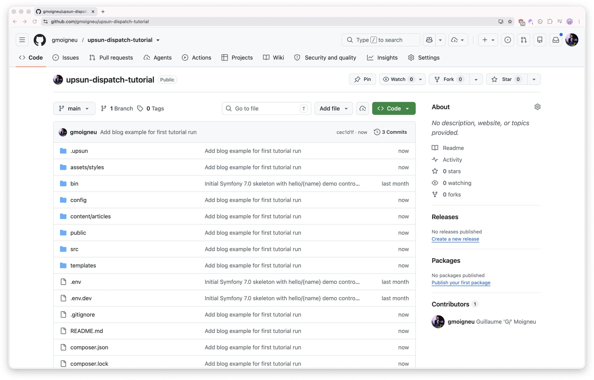
*The demo repo. Click **Fork** in the top-right.*

**2.** Click **Fork**. On the *Create a new fork* screen, leave the defaults: your account as the
**Owner**, the repository name as `upsun-dispatch-tutorial`, and **Copy the `main` branch only**
checked. Click **Create fork**.

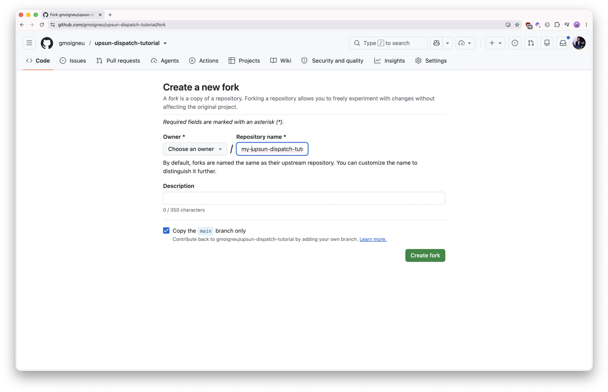
*Keep the defaults and click **Create fork**.*

**3.** GitHub copies the repo into your account. After a few seconds you'll land on your fork (the
owner in the URL is now you, not `gmoigneu`).

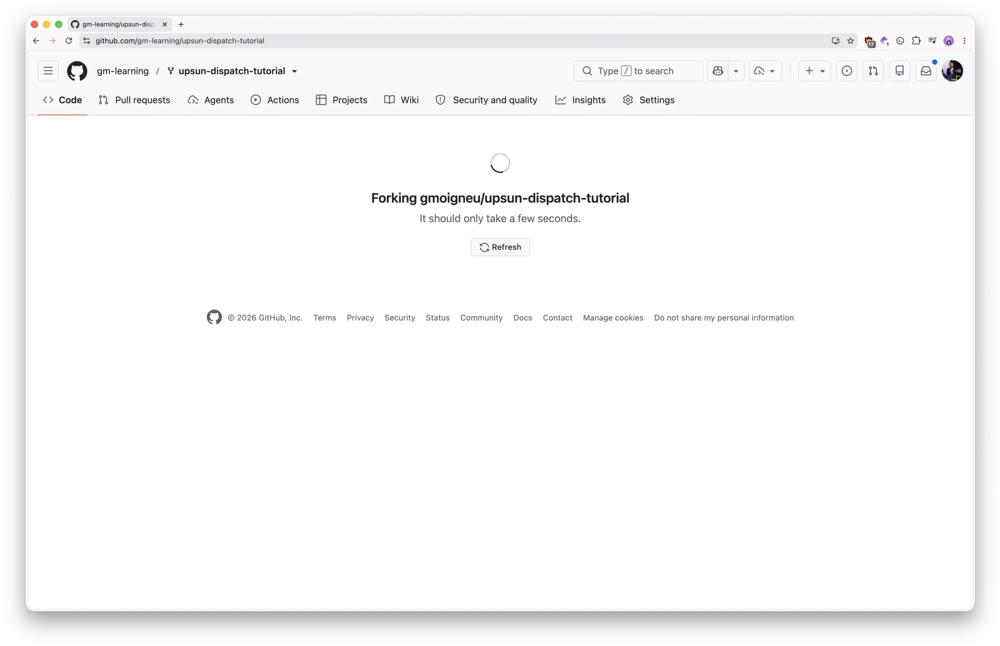
*Forking takes a few seconds. When it's done you're looking at your own copy.*

> **💻 Prefer the terminal?**
> ```bash
> # Forks into your account and clones it locally in one step
> gh repo fork gmoigneu/upsun-dispatch-tutorial --clone
> cd upsun-dispatch-tutorial
> ```

---

## Part 2: Deploy your fork to Upsun Cloud

Now connect that fork to Upsun. Upsun's GitHub integration deploys your `main` branch to production
and creates a live preview environment for every future pull request. That preview is what you'll
use in Part 4.

**1.** Go to **[console.upsun.com](https://console.upsun.com)** and log in. You can use the same
GitHub account you just forked with, or any other sign-in method.

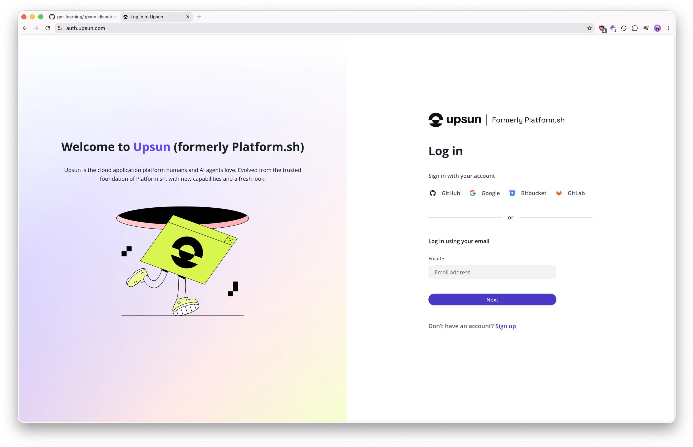
*Log in to Upsun at auth.upsun.com.*

**2.** You'll land on your projects list. Click **+ Create project** (top-right).

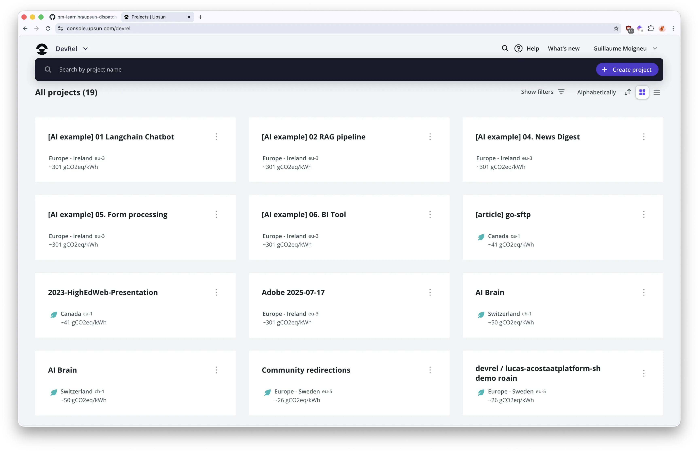
*The Console. Click **+ Create project**.*

**3.** On **Deploy your application**, choose the first option, **Sync your GitHub repository with
Upsun**, and click **Get started**. This is the option that auto-deploys from GitHub pull requests
and branches.

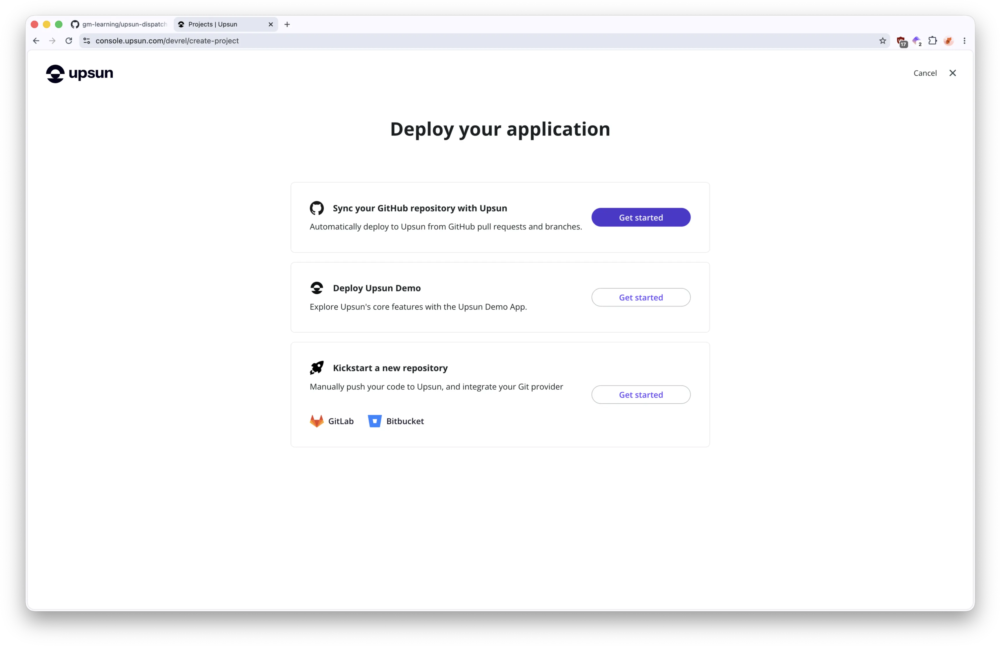
*Pick **Sync your GitHub repository with Upsun**.*

**4.** GitHub asks you to install and authorize the **Upsun PaaS** app. Pick **All repositories**
(simplest) or **Only select repositories** and choose your `upsun-dispatch-tutorial` fork, then
click **Install & Authorize**.

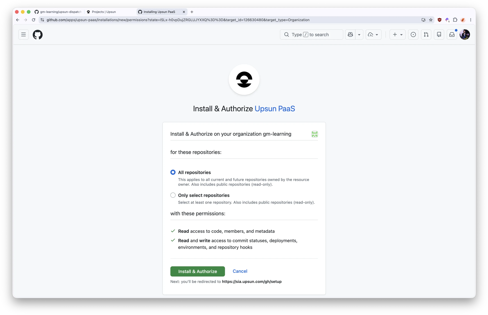
*Grant Upsun access to your fork, then **Install & Authorize**.*

**5.** Back in Upsun, choose your **GitHub organization** (your account) and select the
**`upsun-dispatch-tutorial`** repository. Click **Continue**.

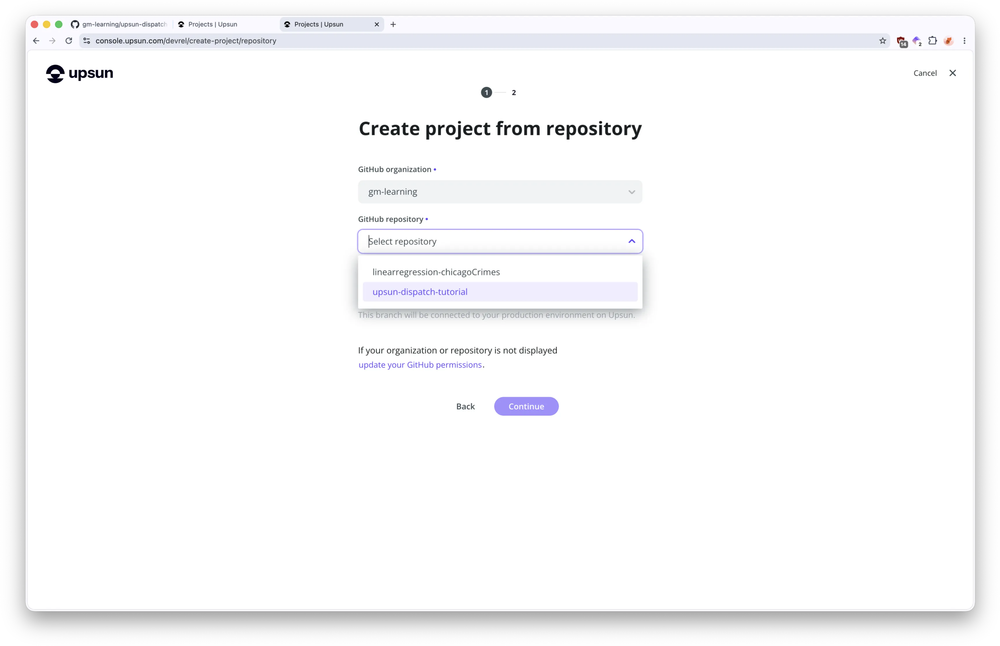
*Select your fork. If it isn't listed, use **update your GitHub permissions**.*

**6.** Give the project a name (e.g. `upsun-dispatch-tutorial`) and pick a **Region**, then click
**Create project**.

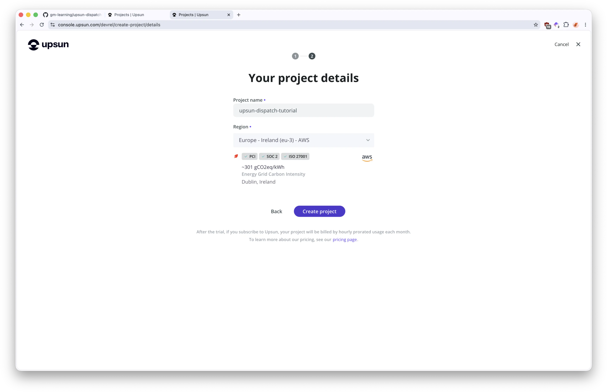
*Name the project and choose a region. Any region is fine for this tutorial.*

**7.** Upsun creates the project and immediately deploys your `main` branch. You'll see the
**GitHub integration pushed to Main** activity running.

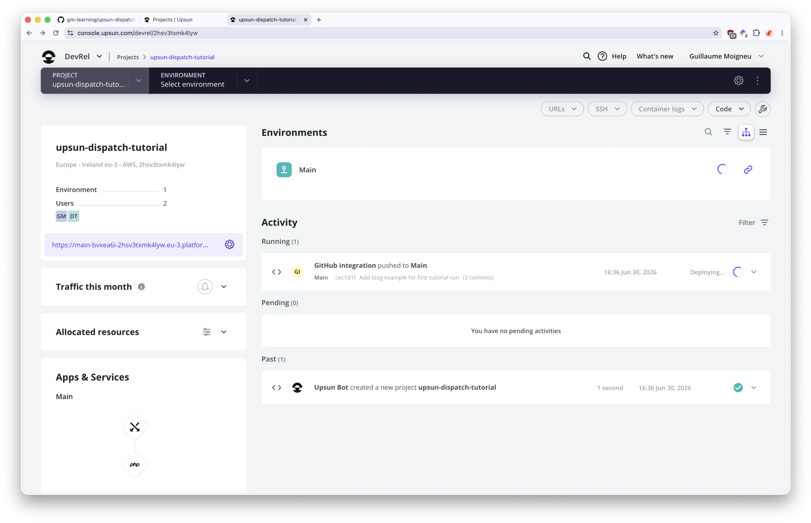
*Upsun deploys `main` automatically. Give it a minute.*

**8.** When the deploy finishes, the **Main** (Production) environment shows a live URL. Click it.

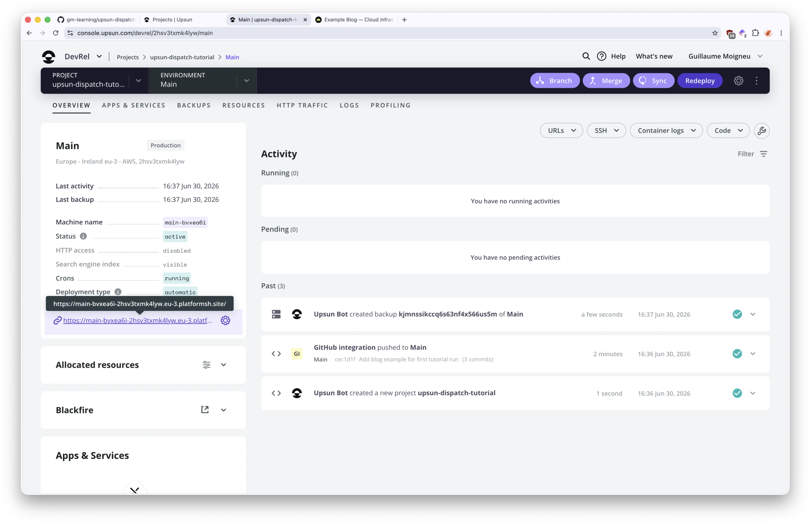
*Your production environment is live. Click the environment URL to open it.*

**9.** Your blog is now live on Upsun.

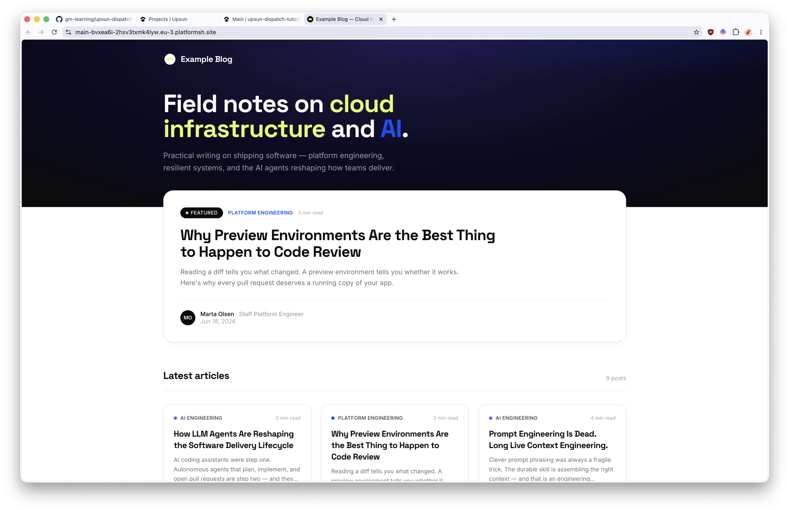
*The demo blog, running on Upsun Cloud.*

> **💻 Prefer the terminal?**
> You can create the project and wire up the GitHub integration from the
> [Upsun CLI](https://docs.upsun.com/administration/cli.html) instead of steps 2 to 8. This replaces
> the Console flow above.
> ```bash
> # Authenticate (once)
> upsun auth:login
>
> # Create the project. Prompts for your organization and region if you omit them.
> upsun project:create --title="upsun-dispatch-tutorial" --default-branch=main
>
> # Connect your GitHub fork so main auto-deploys and every PR gets a preview.
> # Needs a GitHub token with the "repo" and "admin:repo_hook" scopes.
> upsun integration:add --type=github \
>   --repository="<your-username>/upsun-dispatch-tutorial" \
>   --token="<your-github-token>" \
>   --build-pull-requests=true \
>   --fetch-branches=true
> ```
> Once the integration is added, Upsun fetches your fork and deploys `main`, the same result as the
> Console flow. The rest of this tutorial is identical.

---

## Part 3: Set up Upsun Dispatch

Dispatch is the piece that reviews your pull requests automatically. It's part of Upsun and uses the
same account. You point it at your repository with a small GitHub app.

**1.** Go to **[dispatch.upsun.com](https://dispatch.upsun.com)**. You're already signed in with the
same Upsun account, so you'll land on the **Welcome to Dispatch** onboarding. Review the *Before you
begin* checklist, then click **Set up Dispatch**.

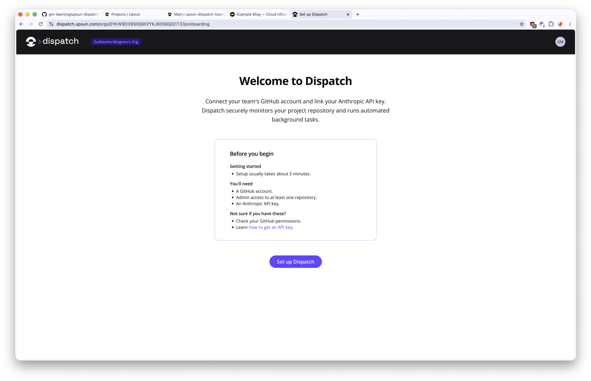
*Dispatch onboarding. Click **Set up Dispatch**.*

> **Note:** the checklist mentions an **Anthropic API key**. Use the key you requested from our
> internal IT team (see Prerequisites) and paste it in when prompted. If you don't have one yet,
> ask IT before continuing.

**2.** On **Connect GitHub to Dispatch**, note what Dispatch can and cannot do. It can read issues,
review pull requests, and suggest code changes, but it **cannot** merge, deploy, or read your
secrets. Click **Connect GitHub**.

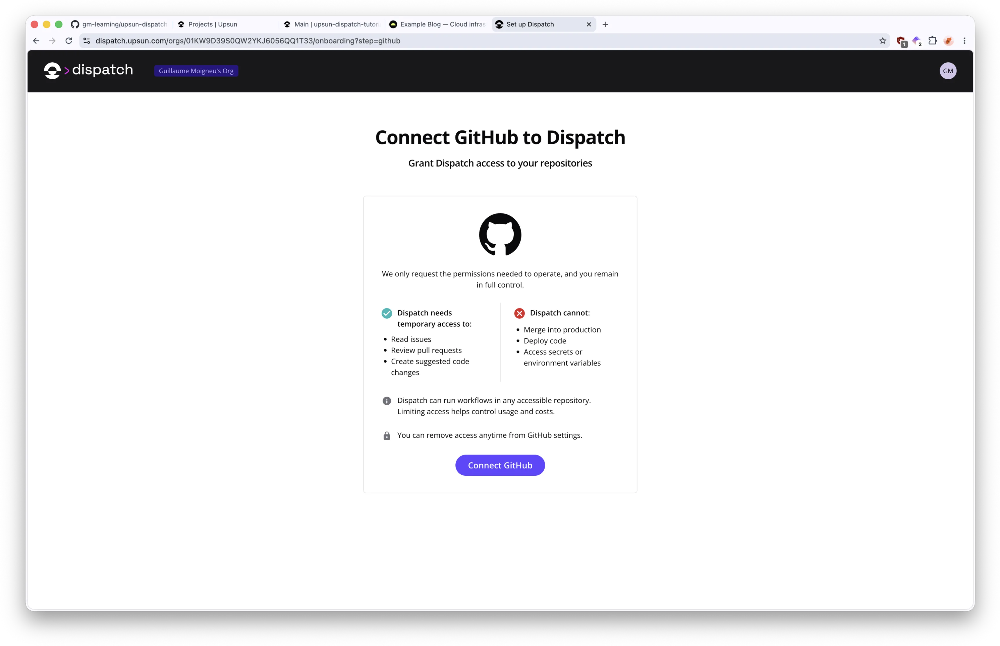
*Dispatch only requests the permissions it needs. Click **Connect GitHub**.*

**3.** GitHub opens the install screen for the **Upsun Dispatch** app. Choose **All repositories**
or select your `upsun-dispatch-tutorial` fork, then click **Install & Authorize**. This is the step
that installs the Dispatch app on your repository, and Dispatch drives it for you.

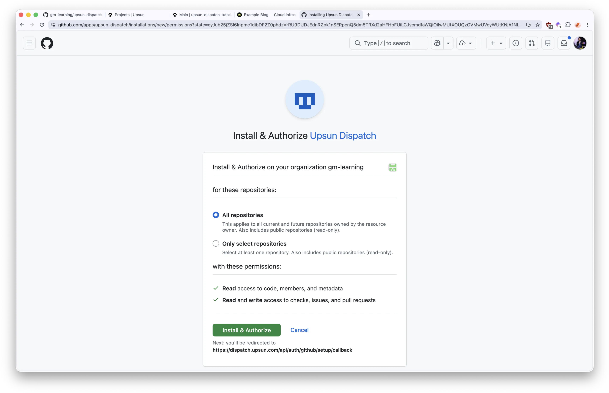
*Install the Dispatch app on your fork, then **Install & Authorize**.*

**4.** You're redirected back to Dispatch and see **You're All Set**. Dispatch now reviews new pull
requests automatically, with no manual trigger. Click **Go to dashboard**.

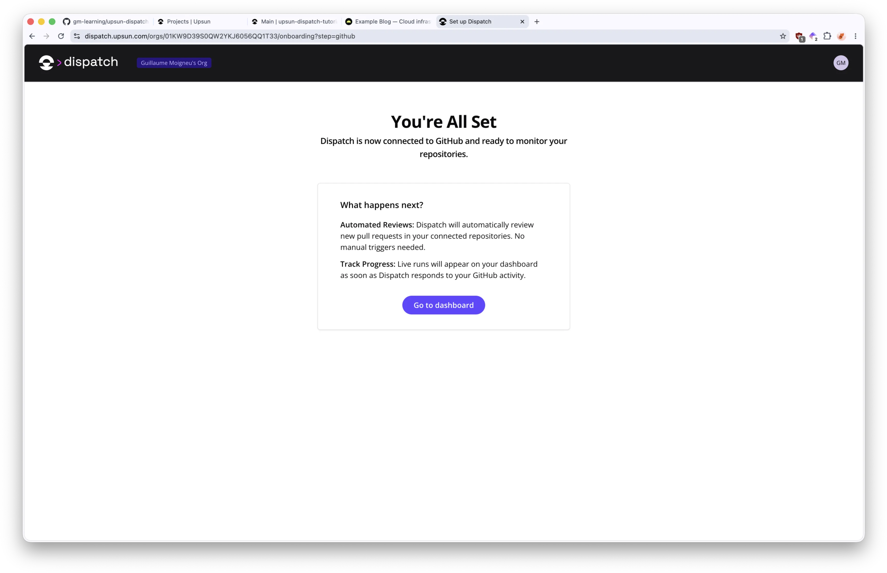
*Dispatch is connected. It reviews new PRs automatically.*

**5.** Optional check: if you visit your GitHub organization's **Settings → Installed GitHub Apps**,
you'll now see both apps installed, **Upsun Dispatch** (the reviewer) and **Upsun PaaS** (the
deployer).

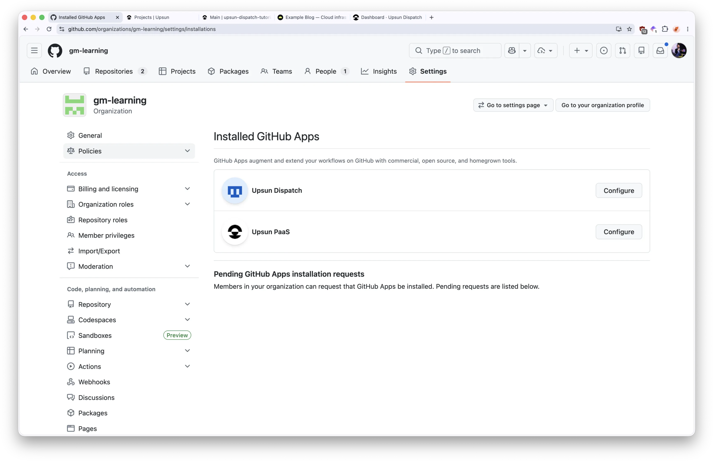
*Both apps are installed: Dispatch reviews, PaaS deploys.*

---

## Part 4: Open a pull request and watch the review

You'll make a small, reasonable-looking change to the reading-time calculation, open a pull request,
and watch two things happen at the same time:

- **Upsun** builds a live preview environment for the PR, and
- **Dispatch** reviews the diff and posts its findings on the PR.

The change looks fine but contains a classic **off-by-one bug**. Dispatch catches it, you fix it,
Dispatch re-reviews and confirms it's clean, and then you merge.

### 4.1 Find the code you'll change

In your fork, open **`src/Blog/ArticleRepository.php`** and find the `readingTime()` method near the
bottom. Right now it's correct and rounds up with `ceil`:

```php
/**
 * Estimated reading time in whole minutes (200 words/minute, minimum 1).
 */
private function readingTime(string $markdown): int
{
    $words = str_word_count(strip_tags($markdown));

    return max(1, (int) ceil($words / 200));
}
```

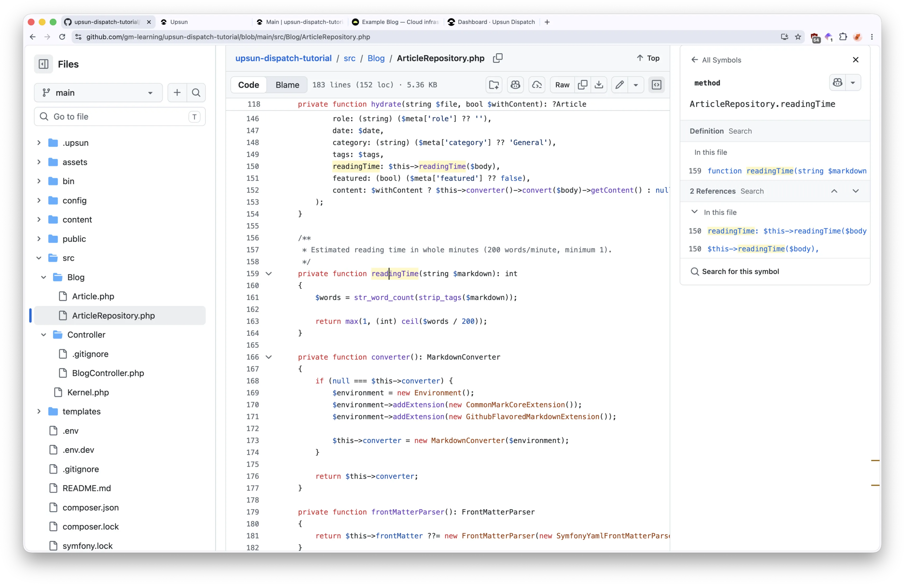
*The current `readingTime()` method uses `ceil`, which is correct.*

### 4.2 Make the change (the one with the bug)

Click the **pencil / Edit** button on the file. Replace the `readingTime()` method with this
version, which pulls the rate into a constant and *tries* to round up a different way:

```php
private const WORDS_PER_MINUTE = 200;

/**
 * Estimated reading time in whole minutes, rounding any partial minute
 * up to a full minute (minimum 1).
 */
private function readingTime(string $markdown): int
{
    $words = str_word_count(strip_tags($markdown));

    // Round up so a partial minute still counts as a full minute.
    return max(1, intdiv($words, self::WORDS_PER_MINUTE) + 1);
}
```

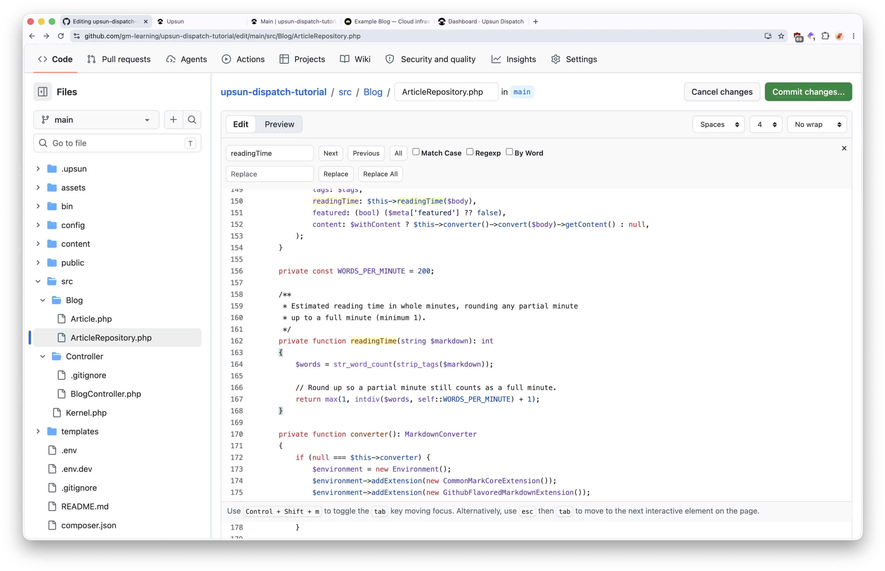
*The new version. It looks reasonable, but `intdiv(...) + 1` does not actually round up correctly.*

<details>
<summary><strong>Why is this a bug?</strong> (expand)</summary>

`intdiv($words, 200) + 1` over-counts whenever the word count is an exact multiple of 200. A
200-word article should be 1 minute but reports 2; a 400-word article should be 2 but reports 3.
The old `ceil($words / 200)` handled these correctly. It's the classic "just add one to round up"
mistake, and it's subtle enough to pass a human skim. That is the kind of thing Dispatch is good at
catching.
</details>

Click **Commit changes…**. In the dialog, choose **Create a new branch for this commit and start a
pull request**, name the branch **`reading-time-calculation`**, and click **Propose changes**.

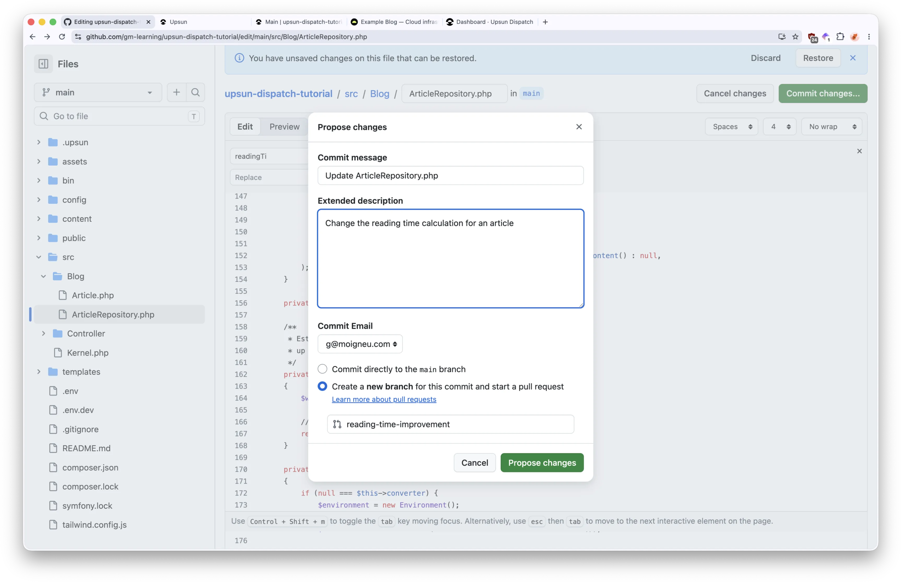
*Commit to a new branch and start a pull request. Name the branch `reading-time-calculation`.*

> **💻 Prefer the terminal?**
> ```bash
> git checkout -b reading-time-calculation
> # edit src/Blog/ArticleRepository.php as shown above
> git commit -am "Update reading time calculation"
> git push -u origin reading-time-calculation
> ```

### 4.3 Open the pull request

GitHub shows the PR form. Give it the title **`Update reading time calculation`** and click
**Create pull request**.

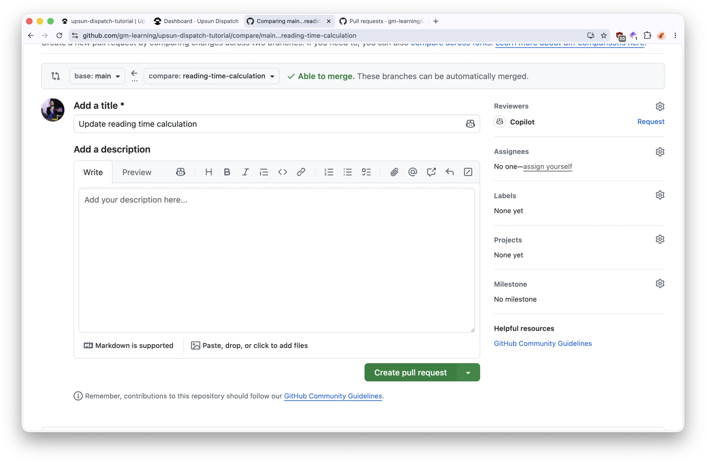
*Title the PR and click **Create pull request**.*

> **A note on numbering:** the screenshots show this as **PR #2** because that account had opened a
> pull request before. In your fresh fork it will be **PR #1**, and the preview URL and the
> `gh pr merge` command below use `1`. Follow along with whatever number GitHub assigns you.

> **💻 Prefer the terminal?**
> ```bash
> gh pr create --title "Update reading time calculation" --body ""
> ```

### 4.4 Watch Dispatch pick it up

Opening the PR triggers Dispatch automatically. Head back to
**[dispatch.upsun.com](https://dispatch.upsun.com)**. The dashboard shows a **PR review** for your
repo in progress, with recent activity below.

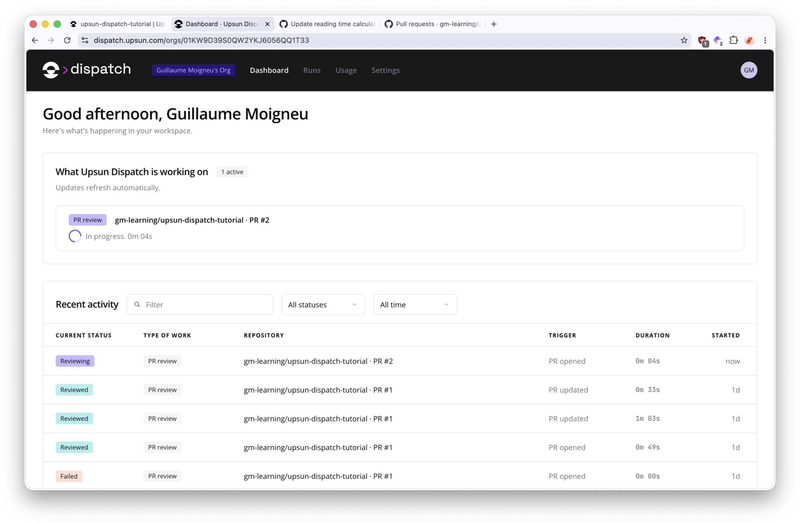
*Dispatch starts reviewing your PR the moment it opens.*

Click into the run to see the **run timeline**, where Dispatch assesses the changes, posts progress,
and reviews. The **Context bundle** shows it's looking at `src/Blog/ArticleRepository.php`.

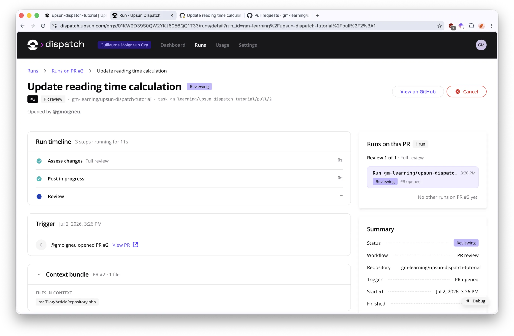
*The run detail: three steps, and the exact file Dispatch is reviewing.*

### 4.5 Meanwhile, Upsun builds a preview environment

At the same time, back in the **Upsun Console**, the GitHub integration has created a new environment
for your PR and is building it. Every pull request gets its own live copy of the app.

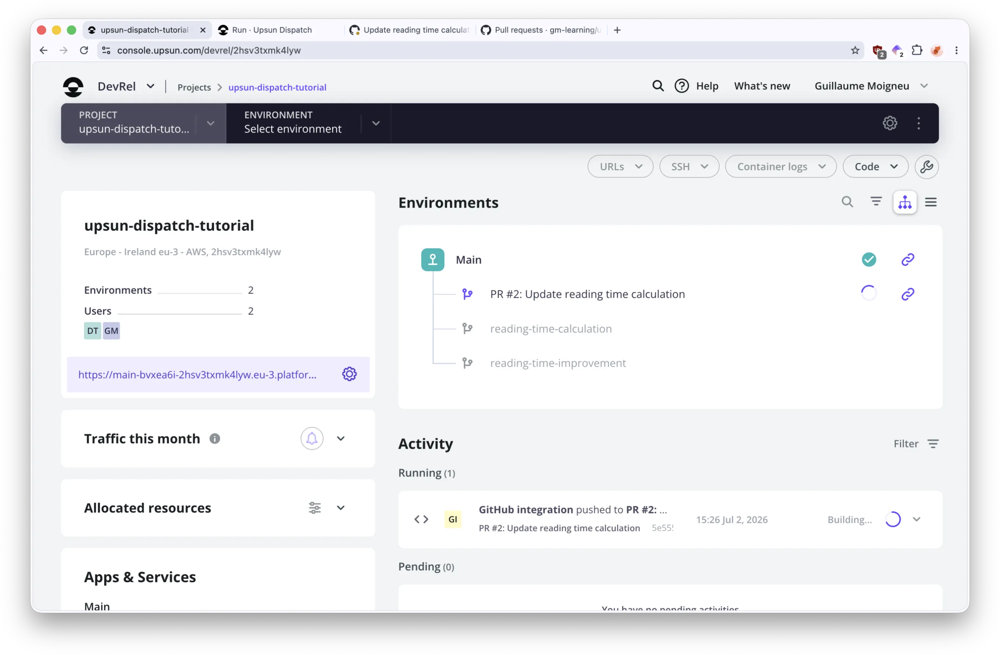
*Upsun spins up a dedicated environment for your PR, branched from Main.*

When it finishes, your PR's environment is **active** with its own URL (something like
`https://pr-1-….platformsh.site`, matching your PR number).

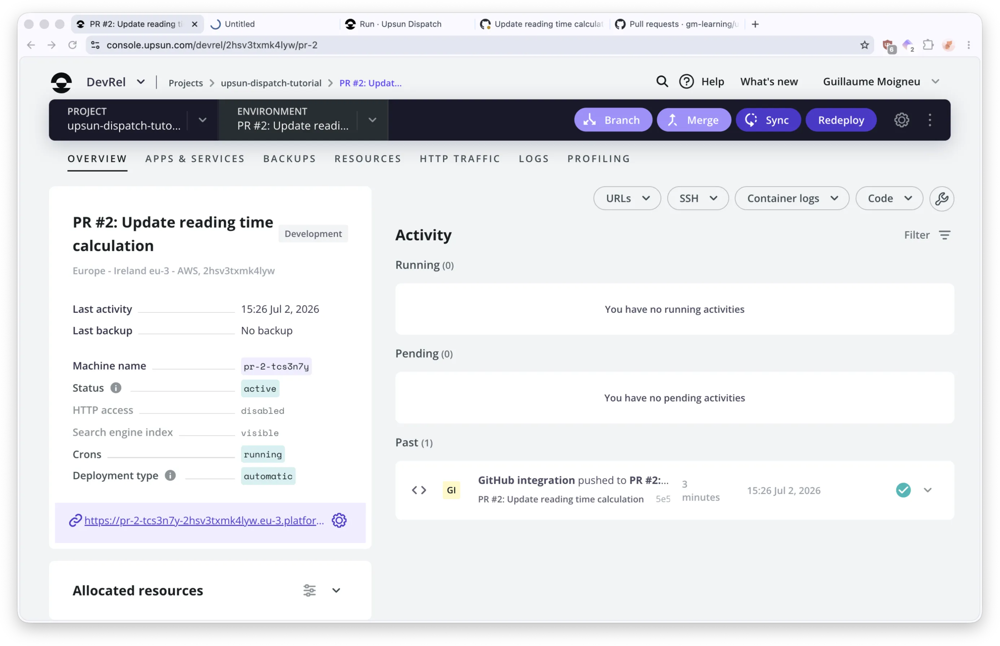
*The preview environment for your PR is live at its own URL.*

Open that URL to interact with your PR's version of the blog, reading times and all, without
touching production.

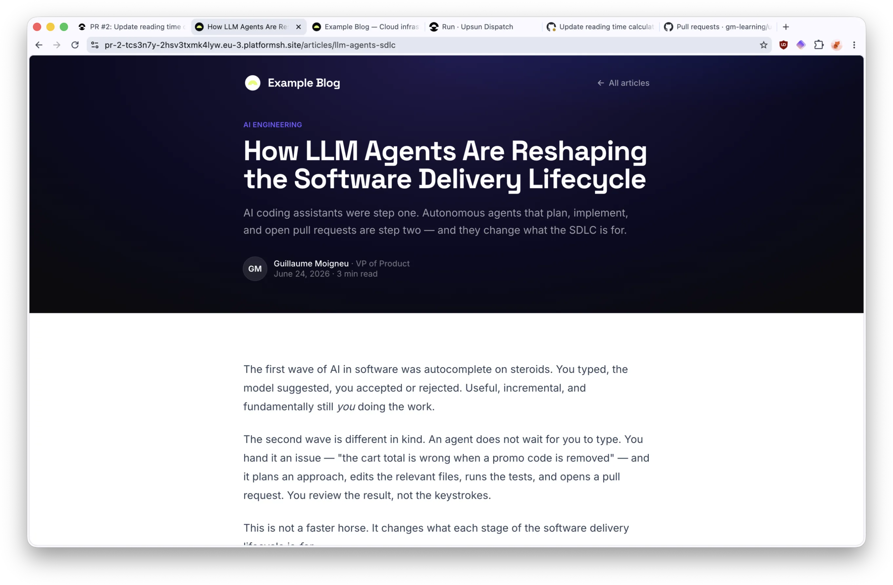
*The PR's preview site. This is the running app for exactly this change.*

### 4.6 Read Dispatch's review

Back on the pull request in GitHub, Dispatch has posted its review as an inline comment on the
changed line, plus a posted review. It flags the off-by-one precisely:

> **Warning:** Off-by-one overcounts reading time for every exact-multiple word count.
> `intdiv($words, self::WORDS_PER_MINUTE) + 1` is not equivalent to the previous ceiling. When
> `$words` is an exact multiple of 200 (e.g. 200 words → 2, 400 words → 3) it adds a spurious extra
> minute… To round partial minutes up correctly use `intdiv($words + self::WORDS_PER_MINUTE - 1,
> self::WORDS_PER_MINUTE)` (or keep `ceil`).

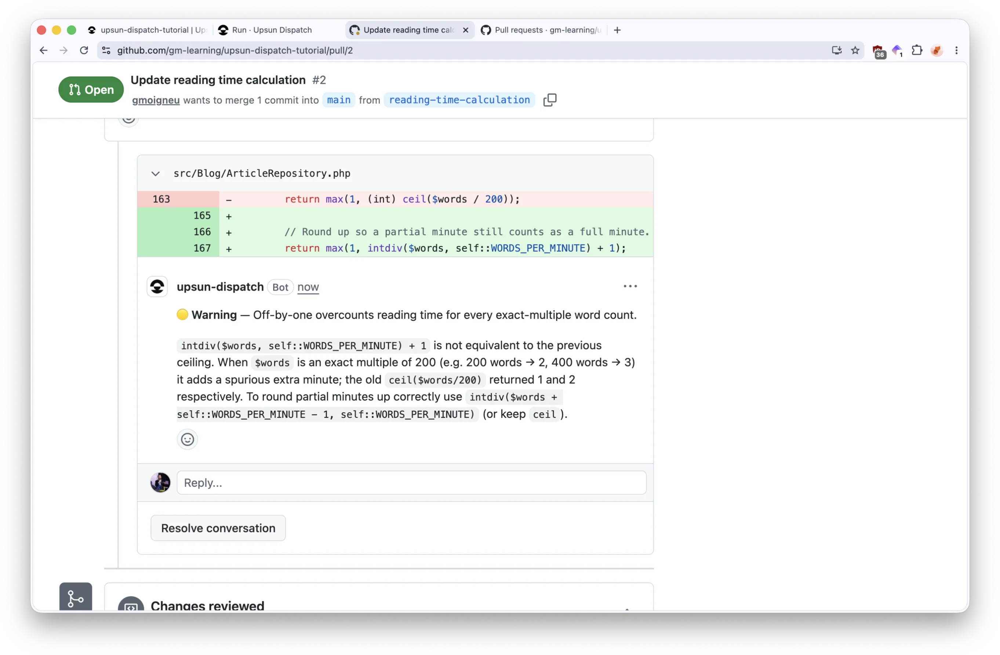
*Dispatch catches the bug, explains it, and suggests the correct fix.*

### 4.7 Apply the fix

Take Dispatch's advice. Edit `src/Blog/ArticleRepository.php` on the PR branch
(`reading-time-calculation`) and correct the rounding:

```php
    // Round up so a partial minute still counts as a full minute.
    return max(1, intdiv($words + self::WORDS_PER_MINUTE - 1, self::WORDS_PER_MINUTE));
```

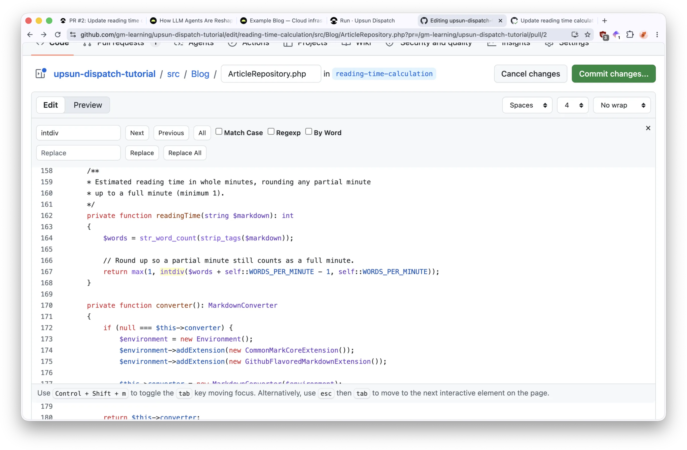
*The corrected formula. This one actually rounds partial minutes up.*

Commit this to the same branch. (In the web editor, make sure the file path shows
`in reading-time-calculation`, not `main`.)

> **💻 Prefer the terminal?**
> ```bash
> # on the reading-time-calculation branch
> git commit -am "Fix off-by-one in reading time calculation"
> git push
> ```

### 4.8 Watch the incremental re-review

Pushing to the branch updates the PR, which triggers Dispatch again, this time an incremental review
of just the new commit.

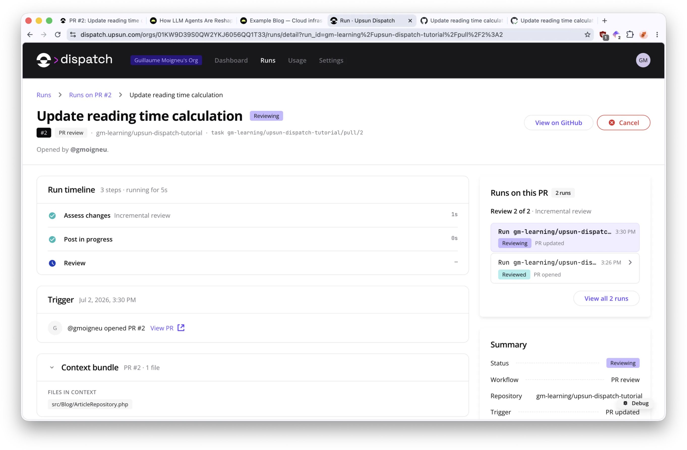
*The second run is an incremental review, triggered by the PR update.*

This time Dispatch posts a clean review: **incremental · 1 file reviewed · no new issues**. The
review details even show the model and review panel used.

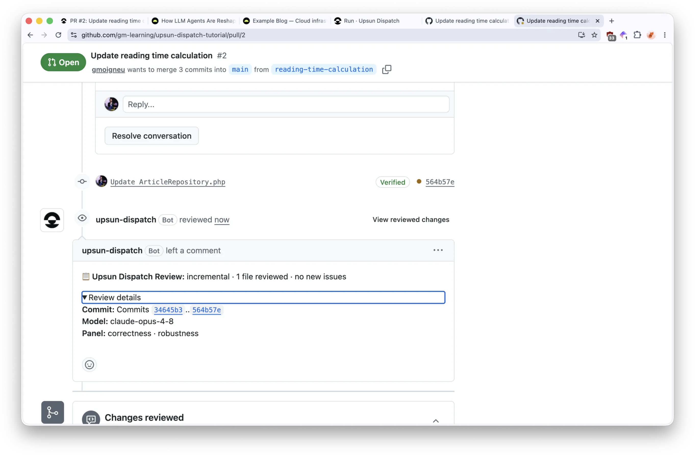
*"No new issues." The fix passes.*

### 4.9 Merge

With a green review, merge the PR. Click **Merge pull request**, then **Confirm merge**.

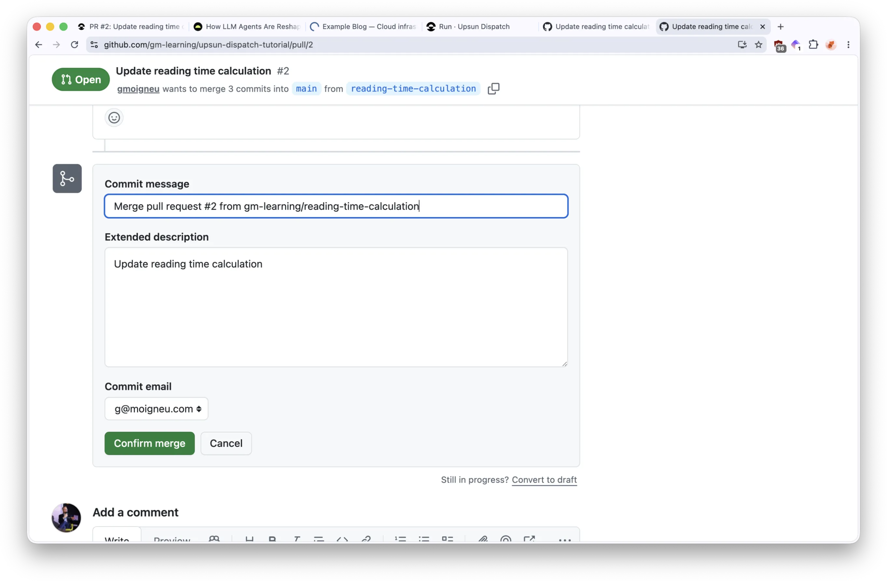
*Merge your PR into `main`.*

> **💻 Prefer the terminal?**
> ```bash
> gh pr merge 1 --merge
> ```

### 4.10 See it live in production

Merging to `main` triggers Upsun to deploy to production, and it automatically tears down your PR's
preview environment. You'll see both activities in the Console.

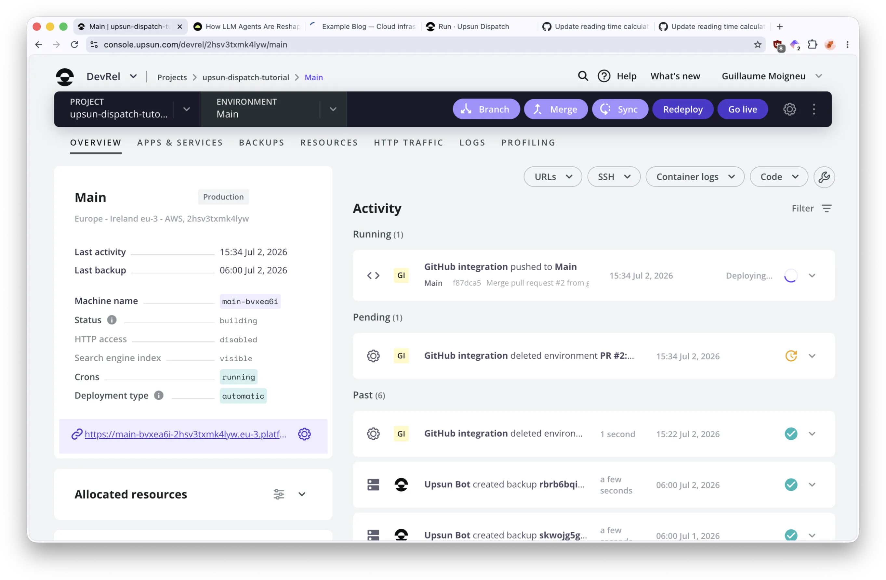
*The merge deploys to production; the PR environment is cleaned up automatically.*

Open your production URL again. Your fix is live.

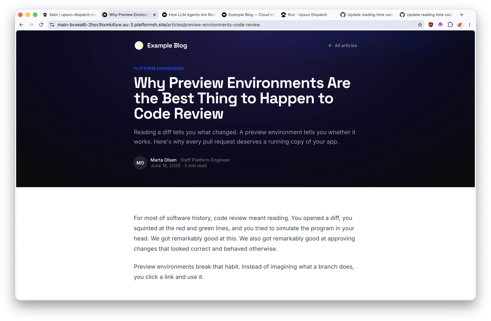
*Your reviewed, corrected change is live in production.*

---

## What just happened

You ran the complete Upsun and Dispatch loop:

1. **Forked** the demo repo into your own GitHub account.
2. **Connected it to Upsun**, which deploys `main` to production and previews every PR.
3. **Set up Dispatch** with a one-click GitHub app install.
4. **Opened a PR** with a subtle bug. In parallel:
   - **Upsun** built a live preview environment for the PR, and
   - **Dispatch** reviewed the diff, caught the off-by-one, and suggested the fix.
5. **Fixed it**, and Dispatch re-reviewed incrementally and confirmed it was clean.
6. **Merged.** Upsun deployed to production and cleaned up the preview automatically.

That's the everyday workflow for teams on Upsun. Every pull request gets a running preview and an
automatic review, so you review behavior and correctness instead of only a static diff.

---

## Cleanup (optional)

- **Delete the Upsun project:** in the Console, open the project, go to **Settings**, and delete it.
- **Remove the GitHub apps:** in your GitHub org or account, go to **Settings → Installed GitHub Apps**, click **Configure** on *Upsun Dispatch* and *Upsun PaaS*, and uninstall.
- **Delete your fork:** in the GitHub repo, go to **Settings** and choose *Delete this repository*.

## Troubleshooting

| Symptom | Fix |
|--------|-----|
| Your repo isn't listed when creating the Upsun project | Click **update your GitHub permissions** on the repo-selection screen and grant access to the fork. |
| Dispatch didn't review the PR | Confirm the **Upsun Dispatch** app is installed on the fork (GitHub → Settings → Installed GitHub Apps), and that the PR targets your fork's `main`. |
| No preview environment for the PR | Confirm the **Upsun PaaS** integration has access to the fork and that "build pull requests" is enabled for the project. |
| Dispatch setup asks for an Anthropic API key | Paste the key you requested from our internal IT team. If you don't have one, ask IT. You'll need it to finish Part 3. |
